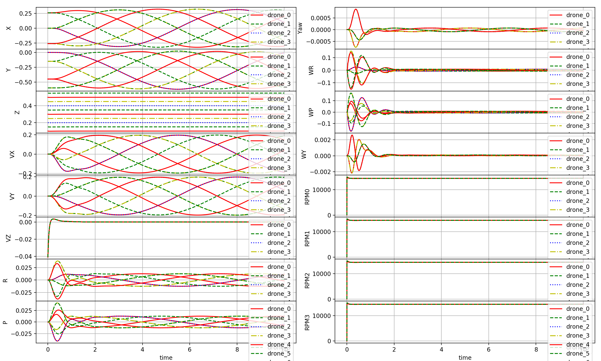

# gym-pybullet-drones

This is a minimalist refactoring of the original `gym-pybullet-drones` repository, designed for compatibility with [`gymnasium`](https://github.com/Farama-Foundation/Gymnasium), [`stable-baselines3` 2.0](https://github.com/DLR-RM/stable-baselines3/pull/1327), and SITL [`betaflight`](https://github.com/betaflight/betaflight)/[`crazyflie-firmware`](https://github.com/bitcraze/crazyflie-firmware/).

> **NOTE**: if you prefer to access the original codebase, presented at IROS in 2021, please `git checkout [paper|master]` after cloning the repo, and refer to the corresponding `README.md`'s.

 

## Installation

Tested on Intel x64/Ubuntu 22.04 and Apple Silicon/macOS 14.1.

```sh
git clone https://github.com/utiasDSL/gym-pybullet-drones.git
cd gym-pybullet-drones/

conda create -n drones python=3.10
conda activate drones

pip3 install --upgrade pip
pip3 install -e . # if needed, `sudo apt install build-essential` to install `gcc` and build `pybullet`
pip3 install sb3-contrib  # for TQC

```

## Use

### PID control for car and drone

Algorithm works for multiple cars and drones
```sh
cd gym_pybullet_drones/simulation/
python3 pid.py # position control 
```

### 

### PID control examples defualt

```sh
cd gym_pybullet_drones/examples/
python3 pid.py # position and velocity reference
python3 pid_velocity.py # desired velocity reference
```

### 
> University of Toronto's [Dynamic Systems Lab](https://github.com/utiasDSL) / [Vector Institute](https://github.com/VectorInstitute) / University of Cambridge's [Prorok Lab](https://github.com/proroklab)
